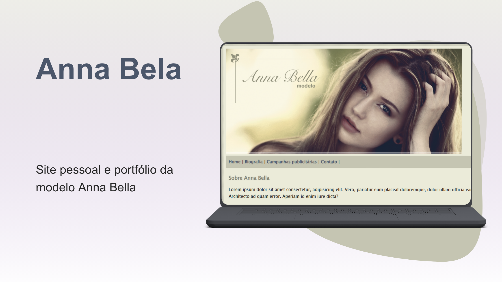

# 🌟 Projeto: Anna Bella

Este projeto foi desenvolvido como parte do curso **"Domine Frontend - 10 projetos - HTML, CSS, JavaScript, TypeScript, React, Tailwind e Next"**, ministrado por **Jamilton Damasceno**.

A proposta foi criar um site fictício para uma modelo chamada **Anna Bella**, utilizando **HTML** e **CSS puros**, com foco na estruturação semântica e na estilização visual.

## 🚀 Tecnologias utilizadas

- HTML5  
- CSS3

## 🔗 Links

- 🔴 [Visualizar site no GitHub Pages](https://thamiressarges.github.io/anna-bella/)  

## 📌 Objetivos do projeto

- Praticar estruturação HTML semântica  
- Aplicar estilização com CSS puro  
- Simular um projeto real de site institucional  
- Desenvolver atenção aos detalhes visuais

---

Feito com 💙 por [Thamires Sarges](https://github.com/thamiressarges)
